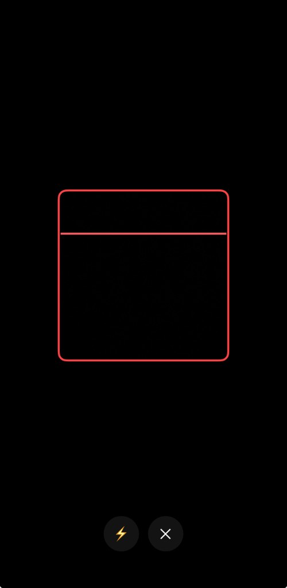

# Cordova QR Scanner Pro

Minimal, production-ready, highly customizable QR scanner plugin for Apache Cordova on **Android** and **iOS**.

> Package id: `cordova-plugin-qrscanner-pro`  
> JS namespace: `cordova.plugins.qrScannerPro`

## Table of Contents

- [UI Preview](#ui-preview)
- [Why this plugin](#why-this-plugin)
- [Installation](#installation)
- [Platform support](#platform-support)
- [Quick start](#quick-start)
- [Platform-focused examples](#platform-focused-examples)
- [API reference](#api-reference)
- [Result object](#result-object)
- [Configuration options](#configuration-options)
- [Debug mode](#debug-mode)
- [Header + SVG icon buttons](#header--svg-icon-buttons)
- [Production recommendations](#production-recommendations)
- [Security notes](#security-notes)
- [Troubleshooting](#troubleshooting)
- [Development and release checklist](#development-and-release-checklist)
- [License](#license)

## UI Preview



## Why this plugin

- Native camera scanning on both platforms
- Fast, stable QR detection with clean UX defaults
- Full-screen customizable scanner UI (scan area, frame, overlay, loader, scan line, header, buttons)
- Straightforward API for app flows (`scan`, `cancel`, `toggleFlash`, `setFlash`)
- Security-friendly design (no network calls, local-only processing)

## Installation

### From npm (recommended)

```bash
cordova plugin add cordova-plugin-qrscanner-pro
```

### From Git

```bash
cordova plugin add https://github.com/pwndex/cordova-qrscanner-pro.git
```

### From local path

```bash
cordova plugin add /absolute/path/to/cordova-plugin-qrscanner-pro
```

## Platform support

| Platform | Supported | Notes |
|---|---|---|
| Android | Yes | Uses ZXing (JourneyApps embedded) |
| iOS | Yes | Uses AVFoundation |

## Quick start

```js
document.addEventListener("deviceready", function () {
  const qr = cordova.plugins.qrScannerPro;

  qr.scan(
    {
      restrictScanToZone: true,
      scanZoneWidth: 280,
      scanZoneHeight: 280,
      darkenOutside: true,
      frameColor: "#00E5FF",
      loaderColor: "#00E5FF",
      loadingDelayMs: 850,
      showFlashButton: true,
      showCancelButton: true,
      headerText: "Align QR in frame",
      headerHeight: 58,
      headerPadding: 12,
      headerBackgroundColor: "#66000000",
      headerTextColor: "#FFFFFF",
      headerFontSize: 17,
      buttonMode: "icon",
      buttonSize: 54,
      buttonCornerRadius: 27,
      buttonSpacing: 14,
      buttonBottomOffset: 56,
      flashButtonSvg:
        "<svg viewBox='0 0 24 24'><path d='M13 2L5 14h6l-1 8 9-13h-6l0-7z'/></svg>",
      flashButtonActiveSvg:
        "<svg viewBox='0 0 24 24'><path d='M12 2l-6 11h5l-1 9 8-12h-5V2z'/></svg>",
      cancelButtonSvg:
        "<svg viewBox='0 0 24 24'><path d='M6 6l12 12M18 6L6 18' stroke='currentColor' stroke-width='2.2' fill='none' stroke-linecap='round'/></svg>",
      buttonTextColor: "#FFFFFF",
      buttonBackgroundColor: "#80111111",
      buttonActiveTextColor: "#111111",
      buttonActiveBackgroundColor: "#FFFFFF",
      flashButtonBackgroundColor: "#AA0057FF",
      flashButtonActiveBackgroundColor: "#FF2F7BFF",
      cancelButtonBackgroundColor: "#AA2A2A2A",
      cancelButtonActiveBackgroundColor: "#FF505050",
      animateScanLine: true
    },
    function onSuccess(result) {
      // result = { text, format, cancelled, rawBytesBase64? }
      console.log("QR:", result.text, result.format);
    },
    function onError(message) {
      // Called on cancel, permission denial, or runtime errors
      console.warn("Scan finished with error:", message);
    }
  );
});
```

## Platform-focused examples

Even though the JS API is the same on both platforms, production UX often differs by platform conventions.

### Android example (larger scan zone + explicit formats)

```js
document.addEventListener("deviceready", function () {
  const qr = cordova.plugins.qrScannerPro;

  function startAndroidScan() {
    qr.scan(
      {
        // Android-friendly defaults for mixed camera quality devices
        scanZoneWidth: 300,
        scanZoneHeight: 300,
        scanZoneOffsetY: -12,
        darkenOutside: true,
        overlayColor: "#99000000",

        frameColor: "#22D3EE",
        frameThickness: 4,
        frameCornerRadius: 14,

        showLoader: true,
        loaderColor: "#22D3EE",
        loadingDelayMs: 900,

        showFlashButton: true,
        showCancelButton: true,
        buttonMode: "icon",
        buttonSize: 54,
        buttonCornerRadius: 27,
        buttonSpacing: 14,
        buttonBottomOffset: 56,
        flashButtonIcon: "⚡",
        cancelButtonIcon: "✕",

        animateScanLine: true,
        scanLineColor: "#22D3EE",
        scanLineThickness: 3,
        scanLineDurationMs: 1700,

        hapticFeedback: true,
        returnRawBytesBase64: true,

        // Android only: helps constrain decoding and improve speed
        formats: ["QR_CODE", "AZTEC", "DATA_MATRIX"]
      },
      function onSuccess(result) {
        console.log("[Android] text:", result.text);
        console.log("[Android] format:", result.format);
        if (result.rawBytesBase64) {
          console.log("[Android] raw bytes present");
        }
      },
      function onError(message) {
        // Includes user cancel and runtime errors
        console.warn("[Android] scan ended:", message);
      }
    );
  }

  document.getElementById("scanBtn").addEventListener("click", startAndroidScan);
});
```

### iOS example (clean UI + strong cancel flow)

```js
document.addEventListener("deviceready", function () {
  const qr = cordova.plugins.qrScannerPro;

  function startIOSScan() {
    qr.scan(
      {
        // iOS-like centered clean layout
        scanZoneWidth: 260,
        scanZoneHeight: 260,
        scanZoneOffsetY: 0,
        darkenOutside: true,
        overlayColor: "#88000000",

        frameColor: "#34D399",
        frameThickness: 3,
        frameCornerRadius: 12,

        showLoader: true,
        loaderColor: "#34D399",
        loadingDelayMs: 750,

        showFlashButton: true,
        showCancelButton: true,
        buttonMode: "icon",
        buttonSize: 54,
        buttonCornerRadius: 27,
        buttonSpacing: 14,
        buttonBottomOffset: 56,
        flashButtonIcon: "⚡",
        cancelButtonIcon: "✕",

        buttonTextColor: "#FFFFFF",
        buttonBackgroundColor: "#A61E1E1E",

        animateScanLine: true,
        scanLineColor: "#34D399",
        scanLineThickness: 3,
        scanLineDurationMs: 1800,

        hapticFeedback: true
      },
      function onSuccess(result) {
        console.log("[iOS] scanned:", result.text);
      },
      function onError(message) {
        // Treat cancel as non-fatal branch
        if ((message || "").toLowerCase().includes("cancel")) {
          console.log("[iOS] user cancelled");
          return;
        }
        console.error("[iOS] scanning failed:", message);
      }
    );
  }

  document.getElementById("scanBtn").addEventListener("click", startIOSScan);
});
```

### Safe URL handling example (both platforms)

```js
function handleScannedText(text) {
  // Never trust scanned input directly
  let url;
  try {
    url = new URL(text);
  } catch (_) {
    console.log("Not a URL, treat as plain text:", text);
    return;
  }

  // Allowlist domains before opening externally
  const allowedHosts = new Set(["example.com", "app.example.com"]);
  if (!allowedHosts.has(url.hostname)) {
    console.warn("Blocked untrusted URL:", url.href);
    return;
  }

  // Open only trusted URLs
  cordova.InAppBrowser.open(url.href, "_system");
}
```

### Flash control example (during active session)

```js
const qr = cordova.plugins.qrScannerPro;

function enableFlashIfAvailable() {
  qr.isFlashAvailable(
    function (info) {
      if (info && info.available) {
        qr.setFlash(true, function () {
          console.log("Flash enabled");
        }, console.warn);
      }
    },
    console.warn
  );
}
```

## API reference

### `scan(options, onSuccess, onError)`

Starts a scanner session.

- **options**: object with scanner customization
- **onSuccess(result)**: called when a code is successfully parsed
- **onError(message)**: called on cancel/error/permission denial

### `cancel(onSuccess, onError)`

Cancels the active scanner session if present.

### `toggleFlash(onSuccess, onError)`

Toggles device torch during active session.

- **success payload**: `{ enabled: boolean }`

### `setFlash(enabled, onSuccess, onError)`

Explicitly sets torch state during active session.

- **enabled**: boolean
- **success payload**: `{ enabled: boolean }`

### `isFlashAvailable(onSuccess, onError)`

Checks torch availability on the current device.

- **success payload**: `{ available: boolean }`

## Result object

Successful `scan` callback returns:

```ts
type ScanResult = {
  text: string;              // Decoded QR content
  format: string;            // QR_CODE | AZTEC | DATA_MATRIX | ...
  cancelled: false;
  rawBytesBase64?: string;   // Android only, if returnRawBytesBase64=true
};
```

## Configuration options

All options are optional. Defaults are safe for production.

### Scan Zone and Detection

| Option | Type | Default | Description |
|---|---|---|---|
| `scanZoneWidth` | number | `260` | Scan area width (dp/pt) |
| `scanZoneHeight` | number | `260` | Scan area height (dp/pt) |
| `scanZoneOffsetY` | number | `0` | Vertical offset for scan area |
| `restrictScanToZone` | boolean | `false` | Accept detection only when code center is inside scan zone |
| `preferFrontCamera` | boolean | `false` | Prefer front camera on iOS (if available) |
| `formats` | string[] | QR-focused defaults | Custom ZXing formats (Android only) |

### Overlay, Frame, and Scan Line

| Option | Type | Default | Description |
|---|---|---|---|
| `darkenOutside` | boolean | `true` | Darken area outside scan zone |
| `overlayColor` | string | `#88000000` | Overlay color |
| `frameColor` | string | `#00E676` | Scan frame color |
| `frameThickness` | number | `3` | Frame stroke thickness |
| `frameCornerRadius` | number | `12` | Frame corner radius |
| `animateScanLine` | boolean | `true` | Enable animated scan line |
| `scanLineColor` | string | `#00E676` | Scan line color |
| `scanLineThickness` | number | `3` | Scan line thickness |
| `scanLineDurationMs` | number | `1800` | Full up/down animation duration |

### Header

| Option | Type | Default | Description |
|---|---|---|---|
| `headerText` | string | `""` | Top centered header text (empty = hidden) |
| `headerHeight` | number | `56` | Header content height (dp/pt), rendered below top safe area |
| `headerPadding` | number | `12` | Inner text padding inside header (dp/pt) |
| `headerBackgroundColor` | string | `#00000000` | Header background color only (safe area keeps app/default background) |
| `headerTextColor` | string | `#FFFFFFFF` | Header text color |
| `headerFontSize` | number | `18` | Header text size |

### Buttons: Layout and Content

| Option | Type | Default | Description |
|---|---|---|---|
| `showFlashButton` | boolean | `true` | Show Flash button |
| `showCancelButton` | boolean | `true` | Show Cancel button |
| `buttonMode` | string | `text` | `text` or `icon` |
| `buttonSize` | number | `52` | Button height; icon mode uses square |
| `buttonTextWidth` | number | `110` | Text mode button width |
| `buttonCornerRadius` | number | `10` | Button corner radius |
| `buttonSpacing` | number | `16` | Space between flash/cancel buttons |
| `buttonBottomOffset` | number | `46` | Distance from bottom edge |
| `flashButtonText` | string | `Flash` | Flash button label |
| `flashButtonIcon` | string | `⚡` | Flash icon in `buttonMode: "icon"` |
| `flashButtonSvg` | string | `""` | Inline SVG or SVG data URL for flash button (icon mode) |
| `flashButtonActiveSvg` | string | `""` | Active-state SVG for flash button (icon mode) |
| `cancelButtonText` | string | `Cancel` | Cancel button label |
| `cancelButtonIcon` | string | `✕` | Cancel icon in `buttonMode: "icon"` |
| `cancelButtonSvg` | string | `""` | Inline SVG or SVG data URL for cancel button (icon mode) |
| `cancelButtonActiveSvg` | string | `""` | Active-state SVG for cancel button (icon mode) |

### Buttons: Colors (Global + Per-Button Overrides)

| Option | Type | Default | Description |
|---|---|---|---|
| `buttonTextColor` | string | `#FFFFFFFF` | Button text/icon color (normal) |
| `buttonBackgroundColor` | string | `#66000000` | Button background color (normal) |
| `buttonActiveTextColor` | string | `#FFFFFFFF` | Button text/icon color (active) |
| `buttonActiveBackgroundColor` | string | `#AA000000` | Button background color (active) |
| `flashButtonTextColor` | string | `""` | Flash text/icon color override (normal) |
| `flashButtonBackgroundColor` | string | `""` | Flash background override (normal) |
| `flashButtonActiveTextColor` | string | `""` | Flash text/icon color override (active) |
| `flashButtonActiveBackgroundColor` | string | `""` | Flash background override (active) |
| `cancelButtonTextColor` | string | `""` | Cancel text/icon color override (normal) |
| `cancelButtonBackgroundColor` | string | `""` | Cancel background override (normal) |
| `cancelButtonActiveTextColor` | string | `""` | Cancel text/icon color override (active) |
| `cancelButtonActiveBackgroundColor` | string | `""` | Cancel background override (active) |

`active` state behavior:
- Flash button: active while pressed and while torch is ON.
- Cancel button: active while pressed.

### Session Behavior and Feedback

| Option | Type | Default | Description |
|---|---|---|---|
| `showLoader` | boolean | `true` | Show loader before returning result |
| `loaderColor` | string | `#00E676` | Loader color |
| `loadingDelayMs` | number | `700` | Delay before success callback |
| `hapticFeedback` | boolean | `true` | Vibrate/beep on success |

### Debug and Platform-Specific

| Option | Type | Default | Description |
|---|---|---|---|
| `debug` | boolean | `false` | Enable native debug logs for scan lifecycle |
| `debugTag` | string | `QrScannerPro` | Prefix tag for native logs |
| `returnRawBytesBase64` | boolean | `false` | Return raw bytes (Android only) |

### Debug mode

Use debug mode when scanner lifecycle events need troubleshooting.

```js
cordova.plugins.qrScannerPro.scan(
  {
    debug: true,
    debugTag: "QrScannerPro",
    showCancelButton: true,
    showFlashButton: true
  },
  onSuccess,
  onError
);
```

Native logs will include events for:
- scanner open/present
- camera permission status
- detection callback
- flash toggle/set state
- cancel button / cancel from JS
- scanner close with success/error

### Header + SVG icon buttons

```js
{
  headerText: "Scan payment QR",
  headerHeight: 60,
  headerPadding: 12,
  headerBackgroundColor: "#66000000",
  headerTextColor: "#FFFFFF",
  headerFontSize: 18,

  frameCornerRadius: 14,
  overlayColor: "#CC000000",
  buttonMode: "icon",
  buttonSize: 54,
  buttonCornerRadius: 27,
  buttonSpacing: 14,
  buttonBottomOffset: 56,

  // Base colors
  buttonTextColor: "#F8FAFC",
  buttonBackgroundColor: "#A61E1E1E",
  buttonActiveTextColor: "#0B1220",
  buttonActiveBackgroundColor: "#E2E8F0",

  // Per-button overrides
  flashButtonBackgroundColor: "#AA0EA5E9",
  flashButtonActiveBackgroundColor: "#FF38BDF8",
  cancelButtonBackgroundColor: "#AA374151",
  cancelButtonActiveBackgroundColor: "#FF6B7280",

  // SVG can be inline XML or data:image/svg+xml,...
  flashButtonSvg: "<svg viewBox='0 0 24 24'><path d='M13 2L5 14h6l-1 8 9-13h-6l0-7z'/></svg>",
  cancelButtonSvg: "<svg viewBox='0 0 24 24'><path d='M6 6l12 12M18 6L6 18' stroke='currentColor' stroke-width='2' fill='none'/></svg>"
}
```

> Header font uses **Satoshi** when available on device; otherwise it falls back to system semibold font.

## Production recommendations

- Keep `loadingDelayMs` between `600-1200` ms for smoother UX
- Use larger scan area for dense or damaged QR codes
- Handle permission denial with clear UI fallback in your app
- Validate QR payload before navigation or API calls
- Add app-level rate limiting if users can scan repeatedly

## Security notes

- No remote calls are made by the plugin
- Scanning is fully local on device
- Treat scanned data as untrusted input
- Use allowlists for URL schemes/domains before opening links

## Troubleshooting

### Camera permission denied

- Ensure camera permission is requested by OS
- Verify `NSCameraUsageDescription` is present in iOS app plist
- Ask user to re-enable permission in system settings

### Flash button does nothing

- Not all devices have torch hardware
- Call `isFlashAvailable()` before enabling flash UX

### Cancel returns error callback

- This is expected behavior in current API design
- Handle cancel as a non-fatal branch in `onError`

## Development and release checklist

- Verify scanning on at least 2 physical Android devices
- Verify scanning on at least 2 physical iOS devices
- Test low light, glare, small QR, and rotated QR cases
- Test permission denied and permission revoked flows
- Pin dependency versions before public release
- Tag release and keep `CHANGELOG.md` per version

## License

MIT
